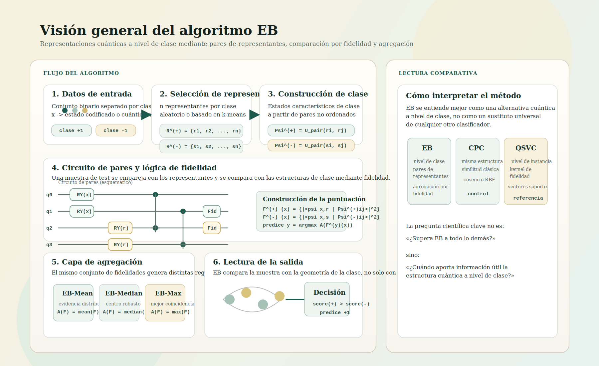
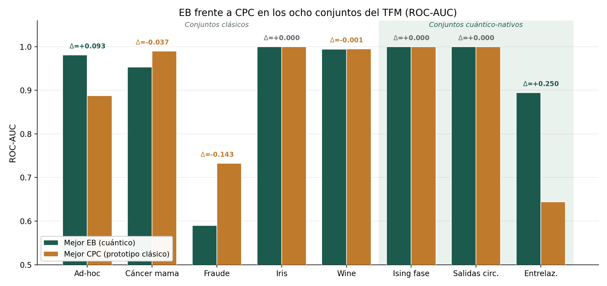
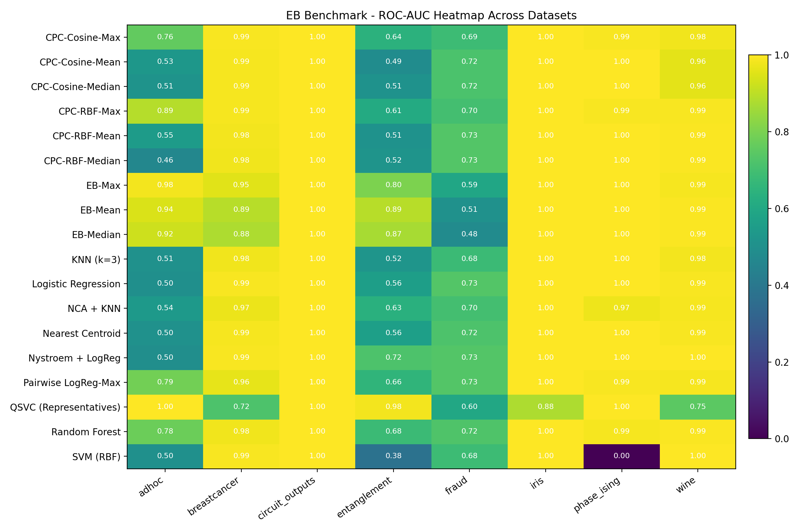

# EB — Clasificador cuántico a nivel de clase mediante agregación de fidelidades

Código de investigación del Trabajo Fin de Máster (TFM) que propone **EB**, un
clasificador **cuántico a nivel de clase**. En lugar de clasificar comparando una
muestra de test con instancias individuales (como hacen QSVC, Q*k*NN, etc.), EB
representa **cada clase** mediante un conjunto de estados cuánticos construidos a
partir de *pares de representantes* y clasifica **agregando fidelidades cuánticas**
entre la muestra de test y esa estructura de clase.

<p align="center">
  
</p>

El repositorio incluye, además del algoritmo, un **espejo clásico (CPC)** que replica
la lógica de EB en el espacio de características clásico para aislar la contribución
específicamente cuántica, un **QSVC** entrenado sobre los mismos representantes y una
batería de **baselines clásicas**, todo sobre un *benchmark* unificado de 8 conjuntos
de datos (5 clásicos codificados + 3 intrínsecamente cuánticos).

> **Nota.** El objetivo no es demostrar superioridad cuántica universal, sino
> caracterizar **en qué regímenes** una representación cuántica de clase aporta valor.

---

## Resultados destacados

EB no es uniformemente superior, pero supera con claridad a su control clásico (CPC)
y a las baselines clásicas en los regímenes con estructura genuinamente cuántica
(*ad-hoc* y *entrelazamiento*):

<p align="center">
  
</p>

<p align="center">
  
</p>

---

## Instalación

Requiere **Python 3.10–3.13** (desarrollado y validado en 3.13, Windows).

```bash
git clone https://github.com/<usuario>/eb-quantum-classifier.git
cd eb-quantum-classifier

python -m venv .venv
# Linux/macOS:
source .venv/bin/activate
# Windows (PowerShell):
.\.venv\Scripts\Activate.ps1

pip install -r requirements.txt
```

Las versiones de `requirements.txt` están fijadas a las del entorno validado, porque
la API de **Qiskit 2.x** y **qiskit-machine-learning 0.9** es sensible a la versión.

---

## Uso rápido

Todos los scripts se ejecutan desde la raíz del repositorio y escriben sus salidas
(CSVs y figuras) en `outputs/` (ignorada por git; se regenera al ejecutar).

```bash
# Benchmark completo: EB + CPC + QSVC + baselines clásicas sobre los 8 datasets
python benchmark_all_methods.py --datasets all
python benchmark_all_methods.py --datasets classical     # solo los 5 clásicos
python benchmark_all_methods.py --datasets quantum        # solo los 3 cuánticos
python benchmark_all_methods.py --datasets iris fraud     # un subconjunto

# Experimentos clásicos/tabulares (orquestador ligero)
python run_experiments.py                                 # los cinco, por defecto
python run_experiments.py --datasets iris wine
python run_experiments.py --datasets adhoc --n-partitions 10 --n-reps 20 --rep-strategy kmeans

# Experimento sobre datos intrínsecamente cuánticos (estados de Ising, etc.)
python ising_eb_experiment.py

# Ablación de la estructura del circuito (§ de la memoria): EB-Entangled / Product / Hadamard
python ablation_circuit_structure.py --n-partitions 10 --n-reps 20

# Figura comparativa EB vs CPC (lee el CSV del benchmark; ejecútalo después del benchmark)
python make_cpc_vs_eb_figure.py
```

Cada módulo `experiment_*.py` también puede ejecutarse de forma aislada con sus valores
por defecto, p. ej. `python experiment_iris.py`.

### Explicador interactivo

`eb_algoritmo_interactivo.html` es un explicador **autocontenido** del pipeline de EB
(sin dependencias): ábrelo en el navegador. Reimplementa en JavaScript el circuito por
pares (RY + CNOT, estado de 4 cúbits) y calcula fidelidades reales, verificadas contra
Qiskit hasta el último decimal.

---

## Conjuntos de datos

| Conjunto | Tipo | Origen |
|---|---|---|
| *ad-hoc* | clásico codificado | generador `ad_hoc_data` de Qiskit |
| Iris | clásico codificado | `sklearn.datasets` (setosa vs. resto) |
| Wine | clásico codificado | `sklearn.datasets` (clase 0 vs. resto) |
| Cáncer de mama (WDBC) | clásico codificado | `sklearn.datasets` |
| Fraude financiero | clásico codificado | **`synthetic_fraud_dataset.csv`** (incluido) |
| Ising rotado en fase | intrínsecamente cuántico | generado por el código |
| Salidas de circuitos | intrínsecamente cuántico | generado por el código |
| Distinguido por entrelazamiento | intrínsecamente cuántico | generado por el código |

Iris, Wine, cáncer de mama y *ad-hoc* se descargan/generan automáticamente. El único
dato externo es **`synthetic_fraud_dataset.csv`** (incluido en el repositorio), un
conjunto **semisintético** de transacciones para detección de fraude.

> Si este CSV procede de una fuente de terceros (p. ej. Kaggle), añade aquí la
> atribución y la licencia originales del dataset.

---

## Estructura del repositorio

```
eb-quantum-classifier/
├── eb_shared.py                 # ★ Núcleo del método: selección de representantes,
│                                #   circuitos por pares, estados de clase, predict_eb,
│                                #   métricas y guardado. Todo lo demás importa de aquí.
├── benchmark_all_methods.py     # Benchmark unificado (EB + CPC + QSVC + baselines)
├── run_experiments.py           # Orquestador de los experimentos clásicos
├── experiment_adhoc.py          # Experimentos por dataset clásico (cada uno expone main())
├── experiment_iris.py
├── experiment_wine.py
├── experiment_breastcancer.py
├── experiment_fraud.py
├── ising_eb_experiment.py       # Experimento sobre datos intrínsecamente cuánticos
├── ablation_circuit_structure.py# Ablación de la estructura del circuito
├── make_cpc_vs_eb_figure.py     # Figura EB vs CPC desde el CSV del benchmark
├── eb_algoritmo_interactivo.html# Explicador interactivo (abrir en el navegador)
├── synthetic_fraud_dataset.csv  # Dataset externo (fraude)
├── assets/                      # Imágenes para este README
├── requirements.txt
├── CITATION.cff
└── LICENSE
```

### Cómo funciona EB (resumen)

1. **Selección de representantes** por clase (`kmeans` por defecto, o `random`).
2. **Estados característicos de clase**: se construye un estado cuántico por cada par
   *no ordenado* de representantes de la clase (`u_pair_*`).
3. **Estructura de test**: la muestra de test se empareja con cada representante de
   cada clase, generando sus propios estados.
4. **Clasificación**: se calculan las fidelidades al cuadrado entre los estados de
   test y los de clase y se **agregan** (`media`, `mediana` o `máximo` → variantes
   EB-Media / EB-Mediana / EB-Máximo); gana la clase con mayor puntuación.

`eb_shared.py` es la **única fuente de verdad** del método: todos los experimentos
importan de él, de modo que la lógica de EB, el QSVC, las métricas y el guardado son
idénticos en todas partes.

---

## Cómo citar

Si usas este código o el algoritmo EB, cita el trabajo (ver `CITATION.cff`):

> J. Bielza Poza, *Representaciones cuánticas a nivel de clase mediante agregación de
> fidelidades: el algoritmo EB*, Trabajo Fin de Máster, Escuela Politécnica Superior,
> Universidad Autónoma de Madrid, 2026.

---

## Licencia

Código bajo licencia **MIT** (ver [`LICENSE`](LICENSE)). El texto de la memoria del TFM
no forma parte de este repositorio.
